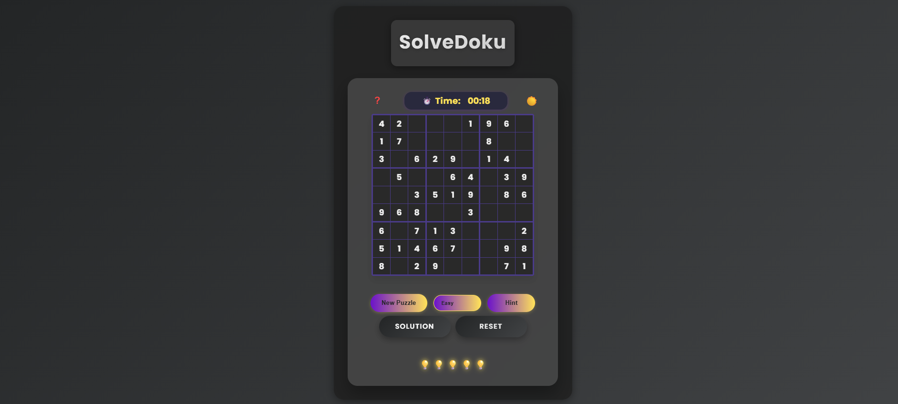

# SolveDoku 🎯



A modern Sudoku puzzle solver with real-time validation and smart features. Play online at [SolveDoku](https://sonamkumari29.github.io/SolveDoku/)

## ✨ Features
- Multiple difficulty levels (Easy, Medium, Hard)
- Smart hint system with 5 hints per puzzle
- Real-time error detection
- Timer tracking
- Dark/Light theme
- Mobile-friendly design

## 🛠️ Tech Stack
- HTML5
- CSS3
- Vanilla JavaScript
- Backtracking Algorithm for puzzle generation

## 🚀 Getting Started

1. Clone the repository
```bash
git clone https://github.com/SonamKumari29/SolveDoku.git
```

2. Open `index.html` in your browser

## 🎮 How to Play
1. Select difficulty level
2. Click cells to input numbers
3. Use hints when stuck
4. Track your time
5. Try to solve without errors!

---


